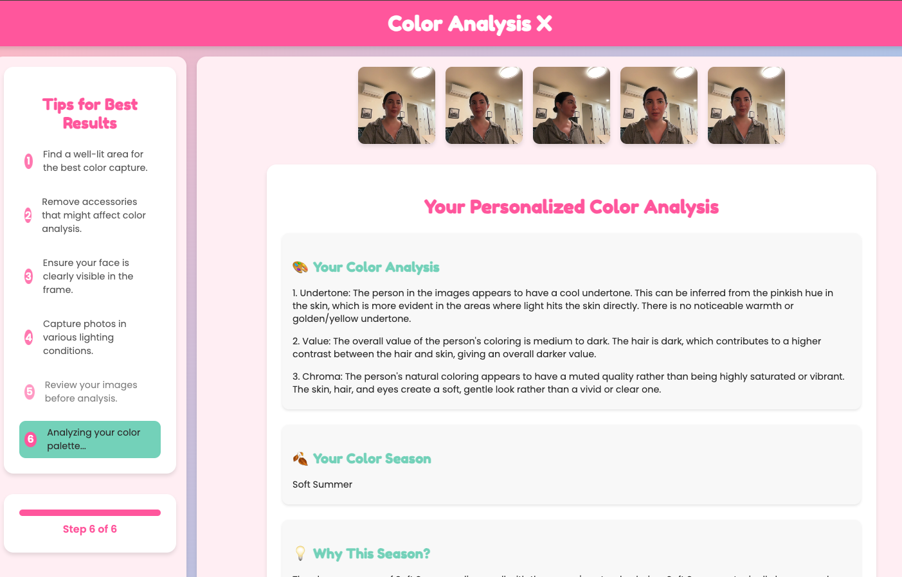

# Color Analysis X

## Description

Color Analysis X is an innovative web application that provides personalized color analysis based on user-uploaded photos. Utilizing advanced image processing and AI techniques, the app determines the user's most flattering color palette according to the 12-season color system. This tool is perfect for fashion enthusiasts, stylists, and anyone looking to enhance their personal style.

<p align="center">
  
</p>

## Features

- Real-time webcam capture for taking photos
- User-friendly interface for capturing and managing up to 5 photos
- AI-powered color analysis using OpenAI's GPT-4
- Detailed results including:
  - Color season determination
  - Explanation of the chosen season
  - Personalized color palette
  - Style recommendations
  - Pro tips for using your colors
- Responsive design for both desktop and mobile use
- Interactive progress indicator and tips guide

## Technologies Used

### Frontend
- React
- TypeScript
- CSS3 (with custom properties for theming)

### Backend
- Python
- Flask
- OpenAI GPT-4o API

## Prerequisites

Before you begin, ensure you have met the following requirements:
- Node.js (v14 or later)
- npm or yarn
- Python (v3.8 or later)
- pip

## Installation

1. Clone the repository:
   ```
   git clone https://github.com/yourusername/color-analysis-x.git
   cd color-analysis-x
   ```

2. Install frontend dependencies:
   ```
   cd frontend
   npm install
   ```

3. Install backend dependencies:
   ```
   cd ../backend
   pip install -r requirements.txt
   ```

4. Set up environment variables:
   - Create a `.env` file in the backend directory
   - Add your OpenAI API key: `OPENAI_API_KEY=your_api_key_here`

## Running the Application

1. Start the backend server:
   ```
   cd backend
   python app.py
   ```

2. In a new terminal, start the frontend development server:
   ```
   cd frontend
   npm start
   ```

3. Open your browser and navigate to `http://localhost:3000`

## Usage

1. Allow camera access when prompted
2. Follow the on-screen tips to capture 5 selfies in different lighting conditions
3. Review your captured images
4. Click "Analyze My Colors!" to start the analysis
5. View your personalized color analysis results
6. Use the "Perform Another Analysis" button to start over

## Contributing

Contributions to Color Analysis X are welcome! Here's how you can contribute:

1. Fork the repository
2. Create a new branch: `git checkout -b feature-branch-name`
3. Make your changes and commit them: `git commit -m 'Add some feature'`
4. Push to the branch: `git push origin feature-branch-name`
5. Create a pull request

Please make sure to update tests as appropriate and adhere to the project's code style.

## License

This project is licensed under the MIT License - see the [LICENSE](LICENSE) file for details.

## Contact

If you have any questions, feel free to reach out to us at:
- Email: vansicklewilly@gmail.com
- Linkedin: [https://www.linkedin.com/in/willyv3/

## Acknowledgments

- OpenAI for providing the GPT-4o API
- The React team for their excellent frontend framework
- AMy lovely girlfriend Sonia for asking me to make an app for her